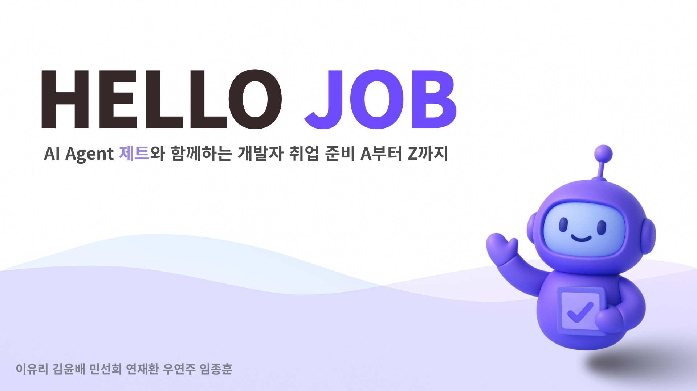
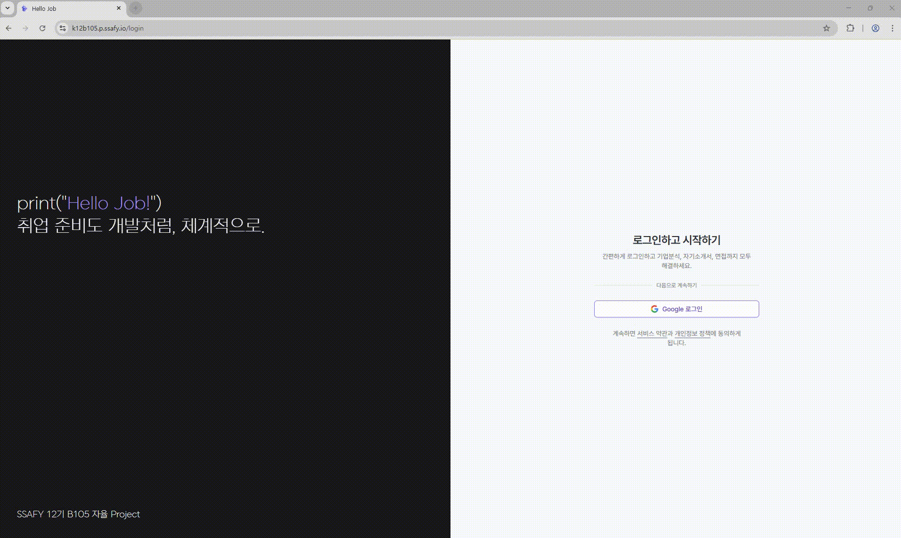
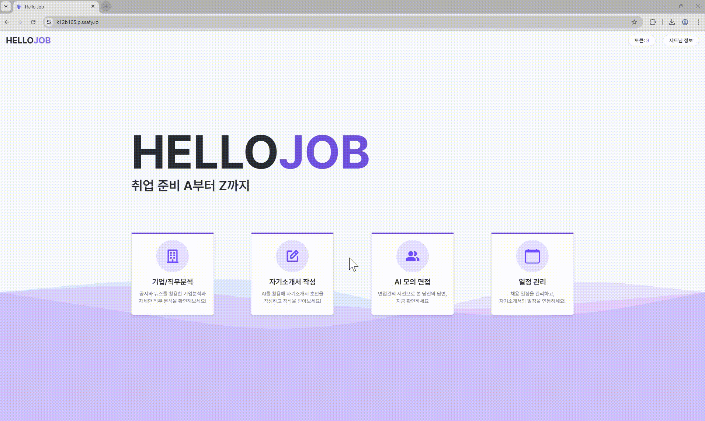
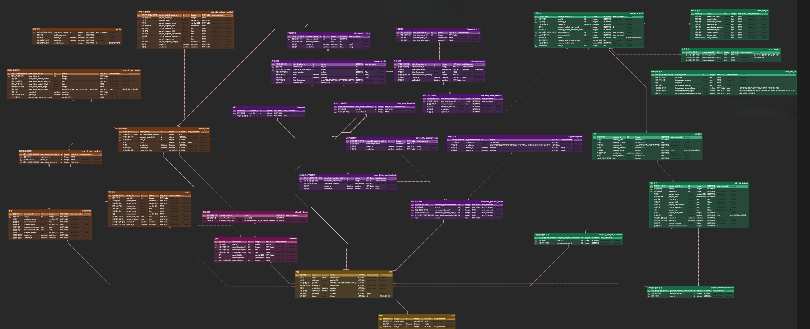
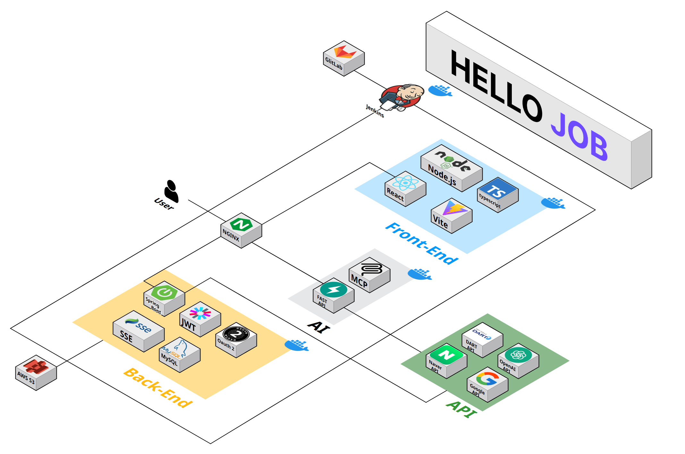

# 💡 Hello Job

<br><br><br>


# 목차
[개요](#-개요)<br>
[서비스](#-서비스) <br>
[팀원](#-팀원) <br>
[기술](#-기술) <br>
[화면](#-화면) <br>
[기술적 특징](#-기술적-특징) <br>
[문서](#-문서) <br>
<br><br>

# 개요
* 프로젝트 명: HelloJob
* 프로젝트 기간: 2025.04.14 - 2025.05.22
* 프로젝트 주관: 삼성 청년 SW/AI 아카데미 
* 수상: 자율프로젝트 최(소)우수상
# 서비스
### [개발자 취업, A부터 Z까지]

#### 1. 기업 및 직무분석 <br>
* Dart 상장 기업, 공기업, 주요 IT 기업들에 대한 기업 분석 자동화
* AI Agent 와 다양한 MCP를 활용한 기업 분석 결과 제공
* 기본, 심화, 재무, SWOT 등 다양한 기업 분석 선택 가능 
* 직무 상세 정보 입력 기능 

#### 2. 자기소개서 초안 작성 및 챗봇  <br>
* 기업 및 직무 분석 내용, 사용자 정보(프로젝트 및 경험)를 기반으로 자기소개서 초안 작성 자동화
* 자기소개서 작성을 도와주는 AI 챗봇 (첨삭 및 피드백 가능)
* 자기소개서 수정 및 임시저장 기능 

#### 3. 모의 면접 <br>
* 자기소개서, CS, 인성 3가지 카테고리 모의 면접 진행
* 문항 선택 면접 및 모의 면접 선택
* 자기소개서 기반 면접 질문 생성
* STT를 활용한 음성 답변 텍스트 변환
* 면접 모습 녹화 및 녹화 영상 제공
* AI Agent를 활용한 면접 답변 피드백 및 예상 꼬리질문 제공

#### 4. 일정관리 <br>
* 드래그앤드롭으로 일정 진행상황 관리
* 캘린더를 통해 직관적인 일정 관리
* 자기소개서와 연동가능한 일정 관리 


#### 5. 마이페이지 <br>
- 일정 관리
- 자기소개서 관리 
- 기업 분석 및 직무 분석 북마크 모아보기 
- 나의 기업 분석 및 직무 분석 모아보기 
- 나의 프로젝트 및 경험 정보
- 모의 면접 영상
<br><br>


# 👨‍👩‍👦‍👦 팀원
<table>
 <th>BackEnd / Infra</th>
 <th>BackEnd</th>
 <th>BackEnd</th>
 <tr>
    <td align="center"><a href="https://github.com/reasonyi"></a></td>
    <td align="center"><a href="https://github.com/Msun-ny"></a></td>
    <td align="center"><a href="https://github.com/WooYeonJu"></a></td>
    
  </tr>
  <tr>
    <td align="center"><b>reasonyi</b></td>
    <td align="center"><b>sunny</b></td>
    <td align="center"><b>WooJeonJu</b></td>
  </tr>
  <tr> 
    <td align="center">이유리</td>
    <td align="center">민선희</td>
    <td align="center">우연주</td>
  </tr> 
</table>
<table>
 <th>FrontEnd</th>
 <th>FrontEnd</th>
 <th>AI</th>
 <tr>
    <td align="center"><a href="https://github.com/kub938"></a></td>
    <td align="center"><a href="https://github.com/ImJongHoon"></a></td>
     <td align="center"><a href="https://github.com/Ja-efan"></a></td>
  </tr>
  </tr>
  <tr>
    <td align="center"><b>kub938</b></td>
    <td align="center"><b>ImJongHoon</b></td>
    <td align="center"><b>Ja-efan</b></td>
  </tr>
  <tr> 
    <td align="center">김윤배</td>
    <td align="center">임종훈</td>
    <td align="center">연재환</td>
  </tr> 
</table>

<br><br><br>

# 🛠 기술 스택
### 🎨 FrontEnd
<div style="">
  
  
  
  
  
  
  
  
  

</div>

### 🖥️ BackEnd
<p align="left">
  
  
  
  
  
  
 
</p>

### ✨ AI 
<p align="left">
  
  
  
  
</p>

### ☁️ Infra
<p align="left">
  
  
  
  
  
    
</p>

### 🛠️ Tool
<p align="left">
  
  
  
  <br>
  
  
  
</p>

# 💻 화면

## 0. 로그인 화면
| 기능 | 화면 |
|------|------|
| 로그인 화면 |  |

<br><br><br>

## 1. 메인 페이지
| 기능 | 화면 |
|------|------|
| 토큰 확인, <br>사용자 닉네임 확인 |  |

<br><br><br>


## 2. 기업 분석 페이지
| 기능 | 화면 |
|------|------|
| 최근 분석된 기업 보기 |  |
| 기업 분석 추가 하기 |  |
| 기업 분석 상세 보기 |  |


<br><br><br>

## 3. 직무 분석 페이지
| 기능 | 화면 |
|------|------|
| 직무 분석 목록 보기<br> 및 북마크 |  |
| 직무 분석 추가하기 |  |
| 직무 분석 상세 보기 |  |

<br><br><br>

## 4. 자기소개서 작성 페이지

| 기능 | 화면 |
|------|------|
| 자기소개서 초안 작성 요청 |  |
| 자기소개서 채팅 및 수정 |  |

<br><br><br>

## 5. AI 모의 면접 페이지

| 기능 | 화면 |
|------|------|
| 자기소개서 기반 문제 생성 |  |
| 선택 문항 면접 |  |
| 실전 모의 면접 |  |
| AI 면접 피드백 |  |

<br><br><br>

## 6. 마이페이지

| 기능 | 화면 |
|------|------|
| 일정 등록 및 관리 |  |
| 자기소개서 목록 |  |
| 북마크 목록 |  |


<br><br><br>


# 🚀 기술적 특징
## 메인 페이지
**[FE]** 
- 캔버스에서 ctx.quadraticCurveTo를 활용한 물결 애니메이션 디자인 적용
- HttpOnly 쿠키를 사용한 인증


## 기업 분석
**[FE]** 
- 기업 hover시 빈 공간에 애니메이션 도입. 캔버스에서 createRadialGradient를 사용하여 기업 정보에 따른 색깔 gradient 구현
- 지연 검색 기능 구현
- tanstack query의 invalidateQueries로 반환 정보 리랜더링
- SSE를 사용한 기업 분석 완료 알림
- CRUD, 북마크 API UI 제작

**[BE]**

- 기업 기본 정보 중 기업 규모 저장을 위해 DART API를 활용하여 기업 총액 및 사원수를 조회하여 기업 규모 분류 및 저장
- 기업 기본 정보 중 업종 코드 기반 업종명 조회 위해 통계청에서 제공하는 한국표준산업분류 코드 활용하여 조회 및 저장
- 기업 기본 정보 저장 테이블과 기업 분석 테이블, DART 상세 테이블, news 분석 테이블, SWOT 분석 테이블로 나누어 별도 저장
- 기업 분석 레포트 생성 위한 FastAPI 연동
    - 유저가 선택한 기업 분석 옵션 및 유저 프롬프트 전송
        - DART 공시 정보가 제공되지 않는 기업의 경우 Spring에서 전처리 후 요청 전송 X
    - 전송 받은 데이터 각각 DART, news, SWOT 테이블로 나누어 저장
        - 유저가 선택하지 않은 옵션의 경우, Spring에서 전처리 후 저장
    - news 출처 url 배열을 Json 형태로 전송 및 저장
    - SWOT 분석 결과 및 키워드 배열 Json 형태로 전송 및 저장
- 기업 분석 북마크 기능
- 공개 비공개 설정
- 기업 분석 레포트 생성 완료 시 SSE 도입하여 유저에게 알림 전송 

**[AI]**
- OpenAI Agent SDK, LangGraph
- 멀티 AI 에이전트 
    - 효율적이고 전문적인 기업 분석을 위해 4개의 AI 에이전트를 구분하여 운영
        - 기본 정보 분석 에이전트 
        - 기업 공시 정보 분석 에이전트
        - 기업 뉴스 정보 분석 에이전트
        - 기업 SWOT 정보 분석 에이전트
- MCP (Model Context Protocol)
    - AI 에이전트가 외부 소스로부터 기업 정보를 수집하기 위한 오픈소스 MCP
        - GOOGLE SEARCH MCP (웹 검색)
        - NAVER SEARCH MCP (웹 검색)
        - DART MCP (공시 정보 검색)
    - 직접 개발한 SWOT MCP
        - AI가 체계적인 SWOT 분석을 할 수 있도록 돕는 순차적 사고 도구 
        - sequentialthinking 에서 착안 
        - 체계적인 분석 프로세스 
        - 단계별 맞춤 가이드 제공 
## 직무 분석
**[FE]** 
- 직무분석 CRUD UI 제작
- 직무분석 CRUD 및 북마크를 tanstack-query를 활용한 상태 관리

**[BE]**
- 직무분석 레포트 북마크 기능
- 직무분석 CRUD 기능 구현


## 자기소개서 초안 작성 
**[FE]** 
- 멀티 form 전역 state 관리
- ux 향상
  - hotjar 유저 히트맵 분석 후 ux 개선
    - 개선사항 확인 가능
  - 최근 선택 기업 리스트 구현
    - LocalStorage에 최근 선택 기업 저장
    - 선택 가능
- 입력에 따른 리렌더링 최적화를 위해 Local State를 사용해 입력이 완료되면 한번에 전역 state 업로드
- step별 validation 로직 구현(hook)

**[BE]**
- 자기소개서 작성 요청 시 직무 분석 스냅샷 추가
- 자기소개서 초안 작성을 위한 FastAPI 통신
    - 관련 기업 분석, 직무 분석, 경험, 프로젝트 데이터 전송
- 전체 문항 상태 조회 API 및 개별 문항 조회 API 구현
- 임시 저장 및 저장 기능 구현


**[AI]**
- OpenAI Agent SDK
- 28장 분량의 '자기소개서 작성 종합 가이드' 딥리서치 보고서를 기반으로 프롬프트 작성 
- AI 에이전트에게 기업 분석, 직무 분석, 프로젝트, 경험 등 풍부한 배경지식을 제공하여 사용자 맞춤형 자기소개서 초안 작성 


## 자기소개서 채팅 
**[FE]** 
- 글자수 제한 표시
- 문항별 status 표시
- AI 제트 답변 로딩 구현
- 채팅시 enter 이벤트 인식 + 2줄 이상 입력시 영역 위로 확장
- AI 답변 마크다운으로 출력
 
**[BE]**
- 수정 채팅을 위한 FastAPI 통신 
    - 관련 기업 분석, 직무 분석, 경험, 프로젝트 테이블 Fetch Join으로 데이터 전송
- 채팅 로그 Json 형태로 전송 및 저장

**[AI]**
- OpenAI ChatCompletion API
- 채팅 로그를 통한 대화 맥락 유지
- 사용자 메시지를 기반으로 시스템 프롬프트 분기 
    - 일반적인 대화 
    - 자기소개서 기반 대화 


## 모의 면접 
**[FE]**
- 오디오 시작, 비디오 녹화 함수 구현
- 오디오, 비디오 Blob 데이터 관리
- 단계별 validation 구현
- 3개로 나눠져있는 api 한개로 통합 관리
- 타이머 로직 구현

**[BE]**
- 자기소개서 기반 질문 생성을 위한 FastAPI 통신
    - 자기소개서 전문 및 관련 경험, 프로젝트 내용 전송
- 면접 영상 S3에 업로드 및 url DB에 저장
- 면접 음성 STT 변환
    - 비동기 처리
    - Blocking Queue 도입하여 안정적인 API 호출
- 변환된 음성 피드백 및 꼬리 질문 생성을 위해 FastAPI 통신
    - 면접 진행한 질문 및 답변들 정보 전송
    - 전송 받은 꼬리질문 배열을 Json 형태로 전송 및 저장
    - 문항별 피드백 및 꼬리질문 별도 저장
    - 전체 피드백 별도 저장
- 모든 답변이 저장된 후 FastAPI에 피드백 요청을 전송하기 위해 Spring Event 도입
    - 모든 답변 저장 및 커밋이 완료된 후 피드백 요청
- 피드백 생성 완료 후 SSE 도입하여 유저에게 알림 전송
- 병렬 처리되는 영상 저장 및 피드백을 안정적으로 저장 후 유저에게 알림을 전송하기 위해 Spring Event 및 ConcurrnetHashMap 도입
- 카테고리별 면접 진행 및 저장
- 면접 진행 도중 종료한 면접 관리를 위해 Spring Scheduler 도입하여 주기적으로 삭제

**[AI]**
- OpenAI Agent SDK
- 13장 분량의 '면접 답변 평가 및 꼬리 질문 생성' 딥리서치 보고서를 기반으로 프롬프트 제작 

## 일정 관리
**[FE]** 
- 드래그앤드롭으로 일정 상태 변경 기능
- 일정 등록 시 입력한 기간으로 달력에 자동 표시
- 달력의 일정 클릭 시 자기소개서 조회로 연결  

**[BE]**
- 일정 상태 테이블로 분리해서 관리 
- 일정 조회 시 연관된 자기소개서 조회

## 마이페이지
**[FE]** 
- 사용자의 데이터 관련 CRUD UI 구현

**[BE]**
- 프로젝트 및 경험 CRUD 기능
- 북마크한 기업분석/직무분석 및 내가 쓴 기업분석/직무분석 조회
- 모의 면접 영상 조회 및 삭제 기능
- 면접 테이블과 피드백 테이블 Join으로 조회

## 기타 
**[AI]**
- 배포 환경과 동일한 컨테이너 환경의 개발환경 구축
- shell script 를 이용한 컨테이너 초기 환경 세팅  
- FastAPI 기반의 AI 서비스 서버 구축
    - 안정적인 AI 서비스 및 용이한 확장성 
- RequestQueue를 활용한 안정적인 외부 API 호출 
    - 1분 간의 토큰 사용량과 예상 토큰량을 기반으로 하는 API 요청 관리 큐 
    - OpenAI API TPM 제한으로 발생하는 오류 및 서비스 중단을 방지하여 안정적인 서비스 운영 

**[FE]**
- router, rendering(ErrorBoundary), api, tanstack query 각각의 레벨에서 에러 핸들링 구현
    - 각각 api or tanstack query 호출시 예상가능한 에러에 대한 핸들링 로직 추가
    - 각기 다른 Error에 따라 다른 화면을 보여주는 ErrorPage 구현(예상치 못한 오류 복구로직)
- 코드 스플리팅으로 초기 렌더링 속도(FCP, LCP) 약 15% 개선
    - suspense를 사용해 렌더링 중 loading 화면 관리
- 디자인 통일성을 위해 디자인 시스템 문서 작성 후 그에 맞게 전역 style 선언 후 사용
- Figma를 활용해 와이어프레임/디자인 작성 후 작업 진행 
- 공통 컴포넌트 구현 후 사용
    - Button, Header, DetailModal, FormInput, ErrorPage
- layout 구현 후 페이지별로 맞는 layout 적용
- zustand 사용으로 전역 상태 관리


<br><br><br>

# 📕 문서
[요구사항 명세서](https://www.notion.so/jaefan/1d6d2e168cd38036b837c10f0d80daca?pvs=4) <br>
[와이어프레임](https://www.figma.com/design/RcHdUixU9cY9Wycmx2S3we/%EC%9E%90%EC%9C%A8-%ED%94%84%EB%A1%9C%EC%A0%9D%ED%8A%B8?node-id=0-1&t=YSciiMfcY9eErBUF-1) <br>
[기능명세서](https://www.notion.so/jaefan/1d8d2e168cd380e4900efb9fb0320259?pvs=4) <br>
[API 명세서](https://www.notion.so/jaefan/API-1ddd2e168cd3803dbca3d2ba2314ffe4?pvs=4) <br>

### ERD


### 아키텍쳐


### 깃 컨벤션
> | HEAD | 설명 |
> | --- | --- |
> | `feat` | 새로운 기능 추가 |
> | `fix` | 버그 수정 |
> | `docs` | 문서 수정 |
> | `style` | 코드 formatting, 세미콜론 누락, 코드 자체의 변경이 없는 경우, 주석 없거나, 파일 또는 폴더 명 수정 |
> | `refactor` | 코드 리팩토링 |
> | `test` | 테스트 코드 |
> | `design` | CSS 등 사용자 UI 디자인 변경 |
> | `remove` | 파일을 삭제하는 작업만 수행한 경우 |
> | `hotfix` | 급하게 수정해야 할 버그 |
> | `chore` | 기타 수정사항 |


**브랜치 명**
> *   Protected: `master`, `release`, `dev`(`-be`, `-fe`, `-ai`)
> *   `{head}/{part}/{jira}/{description}`
> *   구분은 '/', 띄어쓰기는 '-'
> *   ex) `feat/fe/s12p31b105-15/OAuth-login`

**커밋 메시지**

> ```
> {HEAD}: {Title}
>
> - Description
> 
> #{JIRA_ISSUE_NUMBER}
>```
> ```
> # example 
>
> feat: 로그인 기능 구현 
> 
> - OAuth 구글 로그인 기능 구현 
> 
> #S12P31B105-15
> ```
> *   기능별로 커밋 ex) 로그인 기능 구현, 로그아웃 기능 구현 
