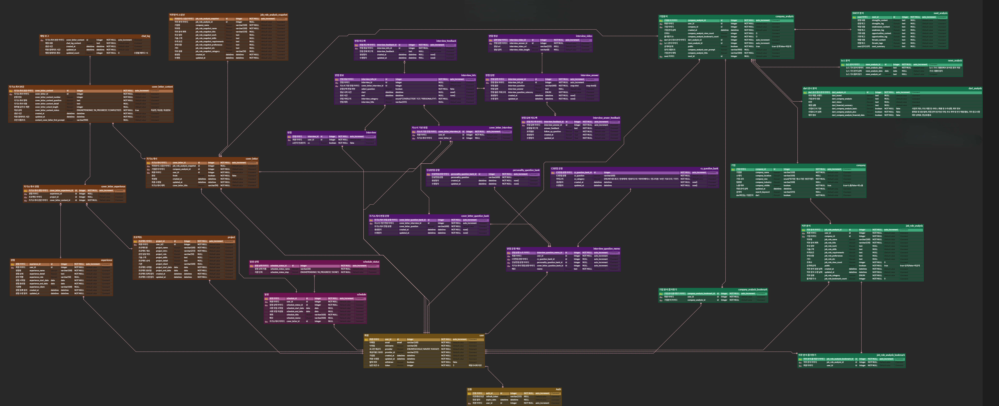
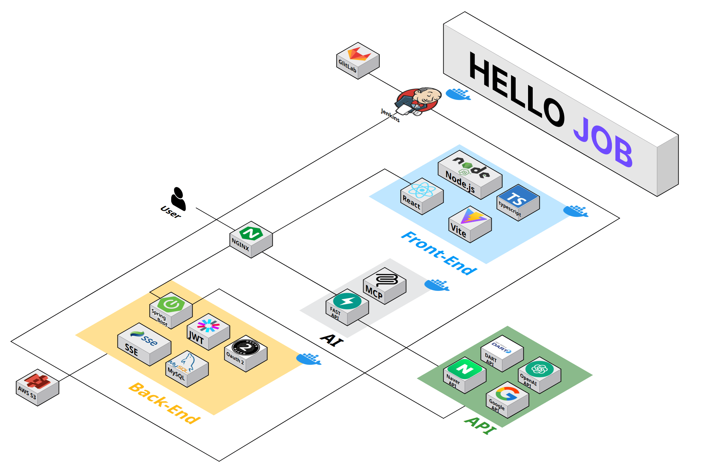

# 💡 Hello Job

<br><br><br>

## 개요
* 프로젝트 명: HelloJob
* 프로젝트 기간: 2025.04.14 - 2025.05.22
* 수상: 자율프로젝트 우수상, 전시 발표회 우수상
* 주제: “취업준비 A부터 Z까지!” LLM을 활용한 취업준비 도움 서비스 플랫폼
* 인원: 6인 (프론트 2인, 백엔드 2인, AI 1인, 백엔드/인프라 1인)
* 기여도: 프론트엔드 50%
* 프로젝트 주관: 삼성 청년 SW/AI 아카데미


## 🛠 기술 스택
<div style="">
  
  
  
  
  
  
  
  
  

</div>

## 🚀 개발 기능
- Zustand 및 부모 컴포넌트를 활용한 스텝 추상화한 자기소개서 작성 페이지(Multi form) 구현
- MD 형식 출력 및 문항 스텝 관리 AI 자소서 채팅 첨삭 구현
- 카메라, 음성 녹음 2개의 파이프라인으로 분리한 저장 로직 구현 + AI 면접 질문 생성 및 피드백 화면 구현
- Figma를 활용해 UI 디자인 및 설계를 통해 팀원간 의견 일치 확인 후 진행


## 🛠️ 트러블슈팅 및 최적화

1. **Code Splitting 및 Lazy Loading 적용 중 트러블 슈팅**
    - **문제**  
      Vite를 활용해 Code Splitting Lazy Loading을 시도 했지만 페이지 접속 시 모든 페이지 청크가 동시에 다운로드 되는 문제 발생 
    - **분석**  
      Button.tsx, Modal.tsx 같은 공통 컴포넌트의 청크를 따로 분리 하지 않음
      그로 인해 manualChounks를 사용해 청크를 강제로 하나의 청크로 묶어 Button,.tsx, Modal.tsx 모듈이 함께 담겨져 버림 
      Vite는 자동으로 같은 모듈을 공유하면 묶어서 청크로 분리 하지만 현재 상황은 임의로 청크를 분리한 상태이기 때문에 shared chunk로 분리되지 않음  
      결과적으로 Home 로드시 Button.tsx와 modal.tsx 모듈이 들어가있는 pages-interview , pages-mypage 청크가 함께 로드  
    - **해결**  
      Rollup Visualizer를 통해 의도하지 않은 청크에 종속되어있는 모듈 확인  
      확인한 모듈을 components-common 청크로 분리  
      page안의 component들을 다른 페이지의 종속성을 고려해 청크 구현  
    - **결과**  
      Code Splitting / Lazy Loading 전 대비 LCP 1.4 → 0.9 초로 0.6초 감소 (Lighthouse 성능테스트 10회 평균 값)  
      불필요한 모듈을 다운하지 않음으로써 네트워크 리소스 감소  
      공통 컴포넌트 청크화로 모든 페이지에서 재사용 → 캐싱 효율 상승  
      공통 컴포넌트 의존성 체인 문제 해결  

|개선 전|개선 후|
|------|------|
|||


2. **복잡한 입력 폼(Multi-step Form)의 상태 관리 최적화 및 구조 개선**
    - **문제:** 다단계 입력 과정에서 발생하는 Props Drilling 문제와 비즈니스 로직/UI의 강한 결합으로 인한 유지보수성 저하
    - **해결:** 입력 데이터는 Zustand로 관리하여 단계 이동 간 데이터 유실을 방지하고  화면 전환 로직은 부모 컴포넌트로 분리 하여 의존성을 낮춤
    - **결과:** 데이터 흐름을 단순화하고 뷰와 로직을 분리함으로써 코드의 가독성 향상 및 유지보수 효율 증대
 
| 개선 전 | 개선 후 |
|------|------|
|||


3. 불필요한 Reflow/Repaint 및 FOIT, FOUT 해결
    - **문제**
      불필요한 렌더링 차단 요소와 중복 폰트 호출로 인한 글씨 깜빡임
    - **분석**
      컴포넌트 내부 <style> 태그로 폰트를 정의하면서 렌더링 이후 CSS가 동적으로 삽입되어 렌더 트리 재계산과 재페인트가 발생했고, 그 과정에서 글씨 깜빡임이 발생
    - **해결:**
      style 태그 제거 및 tailwind로 css 적용/font preload 적용
    - **결과:**
      <style>태그를 삭제 및 tailwind로 적용시킴으로써 dom이 아닌 cssom 구성 시점에 style을 적용시켜 불필요한 Reflow/Repaint 제거
      초기 preload된 font를 사용함으로써  FOIT, FOUT을 방지해 사용자 경험을 향상 시킬 수 있었음

| 개선 전 | 개선 후 |
|------|------|
|||

4. **데이터 기반의 UX 분석 및 개선**
    - **문제:** 사용자가 서비스 목표에 도달하기까지 불필요한 탐색 과정과 클릭이 다수 발생하는 비효율 식별
    - **해결:** **Hotjar 히트맵 분석**을 통해 실제 사용자의 행동 패턴을 시각화하고, 이를 근거로 병목 구간의 UI 동선을 재설계
    - **결과:** 사용자 목표 도달에 필요한 **클릭 수를 기존 대비 40% 단축**시키며 사용성 강화
    
| 개선 전 | 개선 후 |
|------|------|
||| 

<br><br>


## 💻 동작 화면
### 1. 자기소개서 작성 페이지

| 기능 | 화면 |
|------|------|
| 자기소개서 초안 생성 |  |
| 자기소개서 첨삭 및 수정 |  |

<br><br><br>

### 2. AI 모의 면접 페이지

| 기능 | 화면 |
|------|------|
| 자기소개서 기반 문제 생성 |  |
| 선택 문항 면접 |  |
| 실전 모의 면접 |  |
| AI 면접 피드백 |  |

<br><br><br>


## 📕 문서
[요구사항 명세서](https://www.notion.so/jaefan/1d6d2e168cd38036b837c10f0d80daca?pvs=4) <br>
[기능명세서](https://www.notion.so/jaefan/1d8d2e168cd380e4900efb9fb0320259?pvs=4) <br>
[API 명세서](https://www.notion.so/jaefan/API-1ddd2e168cd3803dbca3d2ba2314ffe4?pvs=4) <br>

### ERD


### 아키텍쳐


### 깃 컨벤션
> | HEAD | 설명 |
> | --- | --- |
> | `feat` | 새로운 기능 추가 |
> | `fix` | 버그 수정 |
> | `docs` | 문서 수정 |
> | `style` | 코드 formatting, 세미콜론 누락, 코드 자체의 변경이 없는 경우, 주석 없거나, 파일 또는 폴더 명 수정 |
> | `refactor` | 코드 리팩토링 |
> | `test` | 테스트 코드 |
> | `design` | CSS 등 사용자 UI 디자인 변경 |
> | `remove` | 파일을 삭제하는 작업만 수행한 경우 |
> | `hotfix` | 급하게 수정해야 할 버그 |
> | `chore` | 기타 수정사항 |


**브랜치 명**
> *   Protected: `master`, `release`, `dev`(`-be`, `-fe`, `-ai`)
> *   `{head}/{part}/{jira}/{description}`
> *   구분은 '/', 띄어쓰기는 '-'
> *   ex) `feat/fe/s12p31b105-15/OAuth-login`

**커밋 메시지**

> ```
> {HEAD}: {Title}
>
> - Description
> 
> #{JIRA_ISSUE_NUMBER}
>```
> ```
> # example 
>
> feat: 로그인 기능 구현 
> 
> - OAuth 구글 로그인 기능 구현 
> 
> #S12P31B105-15
> ```
> *   기능별로 커밋 ex) 로그인 기능 구현, 로그아웃 기능 구현 
